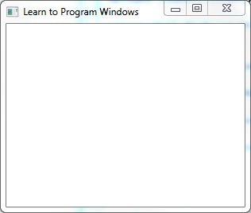

# 0. 开始使用Win32和C++

官网[链接](https://docs.microsoft.com/en-us/windows/win32/learnwin32/learn-to-program-for-windows)

本入门系列的目的是教您如何使用`Win32`和`COM API`在`C++`中编写桌面程序。

在第一个单元中，您将逐步了解如何创建和显示窗口。 后面的单元将介绍组件对象模型`COM`，图形和文本以及用户输入。

对于本系列内容，我们假设您具有良好的`C++`编程工作知识，没有`Windows`编程经验。 如果您不熟悉C++，可以在Visual C++开发人员中心找到学习资料。

|              单元              |                             介绍                             |
| :----------------------------: | :----------------------------------------------------------: |
|              开始              |   本单元介绍`Windows`编程中使用的一些基本术语和编码约定。    |
| 单元1.您的第一个`Windows`程序  |  在此模块中，您将创建一个显示空白窗口的简单`Windows`程序。   |
| 单元2.在`Windows`程序中使用COM | 本单元介绍了组件对象模型COM，它是许多现代`Windows` API的基础。 |
|      单元3. `Windows`图形      |       本单元介绍`Windows`图形架构，重点介绍Direct2D。        |
|         单元4.用户输入         |                 本单元描述了鼠标和键盘输入。                 |

# 1. 准备开发环境

## 1.1. 安装`Windows` SDK

要使用C或C++编写`Windows`程序，必须安装Microsoft `Windows`软件开发工具包（SDK）或包含`Windows` SDK的开发环境，例如Microsoft Visual C++。`Windows` SDK包含编译和链接应用程序所需的头文件和库。`Windows` SDK还包含用于构建`Windows`应用程序的命令行工具，包括Visual C++编译器和链接器。虽然您可以使用命令行工具编译和构建`Windows`程序，但我们建议您使用功能齐全的开发环境，例如Microsoft Visual Studio。Microsoft Visual C++ Express是Visual C++的免费下载版本，可从https://go.microsoft.com/fwlink/p/?linkid=181514获得。

`Windows` SDK的每个版本都以最新版本的`Windows`以及多个先前版本为目标。发行说明列出了受支持的特定平台，但除非您为非常旧版本的`Windows`维护应用程序，否则应安装最新版本的`Windows` SDK。您可以从https://go.microsoft.com/fwlink/p/?linkid=129787下载最新的`Windows` SDK 。

`Windows` SDK支持32位和64位应用程序的开发。实际上，`Windows` API的设计使得相同的代码可以在不进行更改的情况下编译为32位或64位。

备注：`Windows` SDK不支持硬件驱动程序开发，本系列不讨论驱动程序开发。有关编写硬件驱动程序的信息，请参阅`Windows`驱动程序入门。

# 2. `Windows`编码约定

如果您不熟悉`Windows`编程，那么在您第一次看到`Windows`程序时可能会感到不安。代码填充了奇怪的类型定义，如`DWORD_PTR`和`LPRECT`，变量的名称如`hWnd`和`pwsz`（称为匈牙利表示法）。值得花些时间学习一些`Windows`编码约定。

绝大多数`Windows` API由函数或组件对象模型`COM`接口组成。很少有`Windows` API作为C++类提供。（一个值得注意的例外是GDI+，它是2D图形API之一。）

## 2.1. 类型定义

`Windows`头文件包含许多类型定义。其中许多都是在头文件`WinDef.h`中定义的。以下是您经常会遇到的一些类型。

### 2.1.1. 整数类型

|   数据类型    | 大小 | 是否有符号? |
| :-----------: | :--: | :---------: |
|   **BYTE**    | 8位  |   无符号    |
|   **WORD**    | 16位 |   无符号    |
|   **DWORD**   | 32位 |   无符号    |
|   **INT32**   | 32位 |   有符号    |
|   **INT64**   | 64位 |   有符号    |
|   **LONG**    | 32位 |   有符号    |
| **LONG LONG** | 64位 |   有符号    |
|  **UINT32**   | 32位 |   无符号    |
|  **UINT64**   | 64位 |   无符号    |
|   **ULONG**   | 32位 |   无符号    |
| **ULONGLONG** | 64位 |   无符号    |

如您所见，这些类型定义中存在一定量的冗余。其中一些重叠仅仅是由于`Windows` API的历史。此处列出的类型具有固定大小，并且32位和64位应用程序的大小相同。例如，`DWORD`类型总是32位宽。

### 2.1.2. 布尔类型

`BOOL`是布尔上下文中使用的整数值的类型定义。头文件`WinDef.h`还定义了两个用于`BOOL`类型的值。

```c++
#define FALSE    0 
#define TRUE     1
```

尽管定义了`TRUE`，但是大多数返回`BOOL`类型的函数都可以返回任何非零值来指示布尔真值。因此，你应该总是这样写：

```cpp
// Right way.
BOOL result = SomeFunctionThatReturnsBoolean();
if (result) { 
    ...
}
```

而非这样：

```cpp
// Wrong!
if (result == TRUE) {
    ... 
}
```

请注意`BOOL`是整数类型，并且不能与C++的`bool`类型互换。

### 2.1.3. 指针类型

`Windows`定义了许多指向X(某种数据类型)的指针形式的数据类型。这些通常在名称中具有前缀`P-`或`LP-`。`LPRECT`是指向`RECT`的指针，其中`RECT`是描述矩形的结构。以下变量声明是等效的。

```cpp
RECT*  rect;  // Pointer to a RECT structure.
LPRECT rect;  // The same
PRECT  rect;  // Also the same.
```

从历史上看，`P`代表“指针”，`LP`代表“长指针”。长指针（也称为远指针）是16位`Windows`需要它们来解决当前段之外的内存范围的保留。该*LP*前缀被保留下来，使其更容易移植的16位代码，32位`Windows`。今天没有区别——指针就是一个指针。

### 2.1.4. 指针精度类型

以下数据类型始终是指针的大小 - 在32位应用程序中为32位宽，在64位应用程序中为64位宽。大小在编译时确定。当32位应用程序在64位`Windows`上运行时，这些数据类型仍然是4个字节宽。（64位应用程序无法在32位`Windows`上运行，因此不会发生相反的情况。）

- **DWORD_PTR**
- **INT_PTR**
- **LONG_PTR**
- **ULONG_PTR**
- **UINT_PTR**

这些类型用于可能将整数强制转换为指针的情况。它们还用于定义指针算术的变量，并定义循环计数器，迭代内存缓冲区中的整个字节范围。更一般地说，它们出现在64位`Windows`上现有32位值扩展到64位的位置。

## 2.2. 匈牙利命名法

匈牙利命名法是在变量名称中添加前缀的做法，以提供有关变量的其他信息。（符号的发明者Charles Simonyi是匈牙利人，因此得名）。

匈牙利语符号以其原始形式提供有关变量的语义信息，告诉您预期的用途。例如，`i`表示索引，`cb`表示以字节为单位的大小（“字节数”），`rw`和`col`表示行号和列号。这些前缀旨在避免在错误的上下文中意外使用变量。例如，如果您看到表达式`rwPosition + cbTable`，您就会知道行号被添加到一个大小，这几乎肯定是代码中的一个错误。

匈牙利表示法的一个更常见的形式使用的前缀，得到类型的信息，例如，*DW*代表`DWORD`和`w`代表`WORD`。

如果你在网上搜索“匈牙利符号”，你会发现很多关于匈牙利符号是好还是坏的意见。一些程序员对匈牙利表示法非常不喜欢。其他人觉得有帮助。无论如何，MSDN上的许多代码示例都使用匈牙利表示法，但您不需要记住前缀来理解代码。

# 3. 使用字符串

`Windows`本身支持UI元素，文件名等的Unicode字符串。Unicode是首选的字符编码，因为它支持所有字符集和语言。`Windows`表示使用UTF-16编码的Unicode字符，其中每个字符都编码为16位值。UTF-16字符称为*宽*字符，以区别于8位ANSI字符。Visual C++编译器支持宽字符的内置数据类型**wchar_t**。头文件WinNT.h还定义了以下**typedef**。

```cpp
typedef wchar_t WCHAR;
```

您将在MSDN示例代码中看到这两个版本。要声明宽字符文字或宽字符字符串文字，请将**L**放在文字之前。

```cpp
wchar_t a = L'a';
wchar_t *str = L"hello";
```

以下是您将看到的其他一些与字符串相关的typedef：

|         类型定义          |     实际类型     |
| :-----------------------: | :--------------: |
|         **CHAR**          |      `char`      |
|   **PSTR** or **LPSTR**   |     `char*`      |
|  **PCSTR** or **LPCSTR**  |  `const char*`   |
|  **PWSTR** or **LPWSTR**  |    `wchar_t*`    |
| **PCWSTR** or **LPCWSTR** | `const wchar_t*` |

## 3.1. Unicode和ANSI函数

当`Microsoft`向`Windows`引入`Unicode`支持时，它通过提供两组并行的API来简化转换，一组用于`ANSI`字符串，另一组用于`Unicode`字符串。例如，有两个函数可以设置窗口标题栏的文本：

- `SetWindowTextA`采用`ANSI`字符串。
- `SetWindowTextW`采用`Unicode`字符串。

在内部，ANSI版本将字符串转换为Unicode。`Windows`标头还定义了一个宏，在`UNICODE`定义预处理程序符号时解析为Unicode版本，否则定义为ANSI版本。

```cpp
#ifdef UNICODE
#define SetWindowText  SetWindowTextW
#else
#define SetWindowText  SetWindowTextA
#endif
```

在MSDN中，该函数以名称`SetWindowText`被记录，即使它实际上是宏名称，而不是实际的函数名称。

新应用程序应始终调用`Unicode`版本。许多世界语言都需要Unicode。如果使用ANSI字符串，则无法本地化您的应用程序。ANSI版本的效率也较低，因为操作系统必须在运行时将ANSI字符串转换为Unicode。根据您的偏好，您可以显式调用Unicode函数，例如`SetWindowTextW`，或使用宏。MSDN上的示例代码通常调用宏，但这两种形式完全相同。`Windows`中大多数较新的API只有Unicode版本，没有相应的ANSI版本。

## 3.2. TCHARS

当应用程序需要同时支持`Windows NT`以及`Windows 95`，`Windows 98`和`Windows Me`时，根据目标平台编译ANSI或Unicode字符串的相同代码非常有用。为此，`Windows` SDK提供了将字符串映射到Unicode或ANSI的宏，具体取决于平台。


|    宏     |  Unicode  |  ANSI  |
| :-------: | :-------: | :----: |
|   TCHAR   | `wchar_t` | `char` |
| TEXT("x") |  `L"x"`   | `"x"`  |

例如，以下代码：

```cpp
SetWindowText(TEXT("My Application"));
```

解析为以下之一：

```cpp
SetWindowTextW(L"My Application"); // Unicode function with wide-character string.

SetWindowTextA("My Application");  // ANSI function.
```

如今**TEXT**和**TCHAR**宏用处不大，因为所有的应用程序应该使用Unicode。但是，您可能会在旧代码和某些MSDN代码示例中看到它们。

Microsoft C运行时库的头文件定义了一组类似的宏。例如，如果未定义`_UNICODE`，**\_tcslen**将解析为**strlen** ; 否则它将解析为**wcslen**，这是**strlen**的宽字符版本。

```cpp
#ifdef _UNICODE
#define _tcslen     wcslen
#else
#define _tcslen     strlen
#endif
```

注意：某些头文件使用预处理器符号`UNICODE`，其他头文件使用`_UNICODE`下划线前缀。始终定义两个符号。创建新项目时，Visual C++默认设置它们。

# 4. 什么是窗口？

## 4.1. 什么是窗口？

显然，窗口是`Windows`的核心。它们非常重要，以至于人们将操作系统命名`Windows`。但什么是窗口？当你想到一个窗口时，你可能会想到这样的东西：



这种类型的窗口称为*应用程序窗口*或*主窗口*。它通常具有带标题栏，**最小化**和**最大化**按钮以及其他标准UI元素的框架。该框架被称为窗口的*非客户区域*，因为操作系统管理窗口的该部分，因此被调用。框架内的区域是*客户区域*。这是程序管理的窗口的一部分。

这是另一种窗口：


如果您不熟悉`Windows`编程，那么UI控件（如按钮和编辑框）本身就是窗口这件事可能会让您感到惊讶。UI控件和应用程序窗口之间的主要区别在于控件本身不存在。相反，控件相对于应用程序窗口定位。拖动应用程序窗口时，控件随之移动，如您所料。此外，控件和应用程序窗口可以相互通信。（例如，应用程序窗口从按钮接收点击通知。）

因此，当你想到*窗口时*，不要简单地想到*应用程序窗口*。相反，将窗口视为编程构造：

- 占据屏幕的某个部分。
- 在给定时刻可能或可能不可见。
- 知道如何绘制自己。
- 响应来自用户或操作系统的事件。

## 4.2. 父窗口和所有者窗口

在UI控件的情况下，控制窗口被称为应用程序窗口的子窗口。应用程序窗口是控制窗口的父级。父窗口提供用于定位子窗口的坐标系。父窗口会影响窗口外观的各个方面; 例如，剪切子窗口，以便子窗口的任何部分都不会出现在其父窗口的边框之外。

另一种关系是应用程序窗口和模态对话框窗口之间的关系。当应用程序显示模式对话框时，应用程序窗口是所有者窗口，对话框是被所有的窗口。被所有的窗口始终显示在其所有者窗口的前面。当所有者最小化时它被隐藏，并且与所有者同时被销毁。

下图显示了一个显示带有两个按钮的对话框的应用程序：


应用程序窗口拥有对话框窗口，对话框窗口是两个按钮窗口的父窗口。下图显示了这些关系：


## 4.3. 窗口句柄(handle)

窗口是对象——它们既有代码又有数据——但它们不是C++类。相反，程序通过使用称为句柄的值来引用窗口。句柄是模糊的类型。实质上，它只是操作系统用来标识对象的数字。您可以将`Windows`描绘为拥有已创建的所有窗口的大表。它使用此表通过其句柄查找窗口。（这究竟是如何在内部工作并不重要。）窗口句柄的数据类型是**HWND**，通常发音为“aitch-wind”。窗口句柄由创建窗口的函数返回：[**CreateWindow**](https://msdn.microsoft.com/library/`Windows`/desktop/dd368900)和[**CreateWindowEx**](https://msdn.microsoft.com/library/`Windows`/desktop/ms632680)。

要在窗口上执行操作，通常会调用一些将**HWND**值作为参数的函数。例如，要在屏幕上重新定位窗口，请调用[**MoveWindow**](https://msdn.microsoft.com/library/`Windows`/desktop/ms633534)函数：

```cpp
BOOL MoveWindow(HWND hWnd, int X, int Y, int nWidth, int nHeight, BOOL bRepaint);
```

第一个参数是要移动的窗口的句柄。其他参数指定窗口的新位置以及是否应重绘窗口。

请记住，句柄不是指针。如果*hwnd*是包含句柄的变量，则尝试通过写入取消引用句柄`*hwnd`是一个错误。

#### 屏幕和窗口坐标

坐标是在与设备无关的像素中测量的。在讨论图形时，我们将更多地谈论与设备无关的像素的设备独立部分。

根据您的任务，您可以测量相对于屏幕的坐标，相对于窗口（包括框架）或相对于窗口的客户区域的坐标。例如，您可以使用屏幕坐标在屏幕上放置一个窗口，但您可以使用客户端坐标在窗口内绘制。在每种情况下，原点（0,0）始终是区域的左上角。


## 1.5. WinMain：应用程序入口点

每个`Windows`程序都包含一个名为WinMain或wWinMain的入口点函数。这是wWinMain的签名。

```cpp
int WINAPI wWinMain(HINSTANCE hInstance, HINSTANCE hPrevInstance, PWSTR pCmdLine, int nCmdShow);
```

这四个参数是：

- hInstance称为“实例句柄”或“模块句柄”。当操作系统加载到内存中时，操作系统使用此值来标识可执行文件（EXE）。某些`Windows`功能需要实例句柄 - 例如，加载图标或位图。
- *hPrevInstance*没有任何意义。它用于16位`Windows`，但现在总是为零。
- *pCmdLine*包含命令行参数作为Unicode字符串。
- *nCmdShow*是一个标志，指示主应用程序窗口是否将被最小化，最大化或正常显示。

该函数返回一个**int**值。操作系统不使用此返回值，但您可以使用返回值将状态代码传递给您编写的其他程序。

**WINAPI**是调用约定。一个调用约定定义了一个函数从主叫方接收参数。例如，它定义参数在堆栈上显示的顺序。只需确保声明您的**wWinMain**函数，如图所示。

所述的**WinMain**函数与**wWinMain**，除了命令行参数作为ANSI字符串传递。Unicode版本是首选。即使将程序编译为Unicode，也可以使用ANSI **WinMain**函数。要获取命令行参数的Unicode副本，请调用[**GetCommandLine**](https://msdn.microsoft.com/library/`Windows`/desktop/ms683156)函数。此函数返回单个字符串中的所有参数。如果您希望参数为*argv*样式数组，请将此字符串传递给[**CommandLineToArgvW**](https://msdn.microsoft.com/library/`Windows`/desktop/bb776391)。

编译器如何知道调用**wWinMain**而不是标准的**main**函数？实际发生的是Microsoft C运行时库（CRT）提供了一个调用**WinMain**或**wWinMain**的**main**实现。

 **备注：**

CRT在**main中**做了一些额外的工作。例如，在**wWinMain**之前**调用**任何静态初始值设定项。虽然您可以告诉链接器使用不同的入口点函数，但如果链接到CRT，请使用默认值。否则，将跳过CRT初始化代码，结果不可预测。（例如，不会正确初始化全局对象。）

这是一个空的**WinMain**函数。

```cpp
INT WinMain(HINSTANCE hInstance, HINSTANCE hPrevInstance,
    PSTR lpCmdLine, INT nCmdShow)
{
    return 0;
}
```

现在您已经了解了程序入口点并了解了一些基本术语和编码约定，您已经可以创建一个完整的Window程序了。
