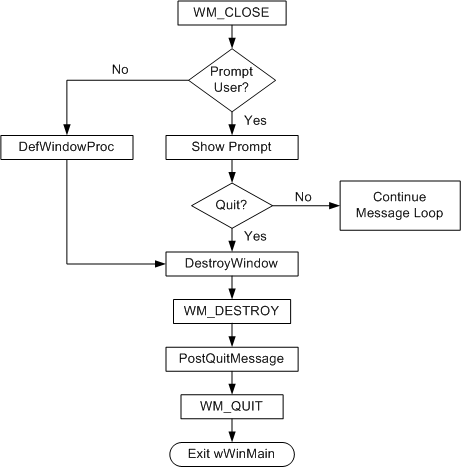

# 001. 单元1——您的第一个Windows程序

在本单元中，我们将编写一个最小的Windows程序。它所做的只是创建并显示一个空白窗口。第一个程序包含大约50行代码，不包括空行和注释。这将是我们的出发点; 稍后我们将添加图形，文本，用户输入和其他功能。


这是该程序的完整代码：

```cpp
#ifndef UNICODE
#define UNICODE
#endif
#ifndef _UNICODE
#define _UNICOE
#endif

#include <windows.h>

LRESULT CALLBACK WindowProc(HWND hwnd, UINT uMsg, WPARAM wParam, LPARAM lParam);

int WINAPI wWinMain(HINSTANCE hInstance, HINSTANCE, PWSTR pCmdLine, int nCmdShow) {
    // Register the window class.
    const wchar_t CLASS_NAME[] = L"Sample Window Class";

    WNDCLASSEXW wcex = {};
    wcex.cbSize = sizeof(WNDCLASSEX);

    wcex.style = CS_HREDRAW | CS_VREDRAW;
    wcex.lpfnWndProc = WindowProc;
    wcex.cbClsExtra = 0;
    wcex.cbWndExtra = 0;
    wcex.hInstance = hInstance;
    wcex.hCursor = LoadCursorW(nullptr, IDC_ARROW);
    wcex.hbrBackground = (HBRUSH)(COLOR_WINDOW + 1);
    wcex.lpszClassName = CLASS_NAME;

    RegisterClassExW(&wcex);

    // Create the window.
    HWND hwnd = CreateWindowExW(0, CLASS_NAME, L"Learn to Program Windows", WS_OVERLAPPEDWINDOW,
                               CW_USEDEFAULT, CW_USEDEFAULT, CW_USEDEFAULT, CW_USEDEFAULT,
                               NULL,      // Parent window
                               NULL,      // Menu
                               hInstance, // Instance handle
                               NULL       // Additional application data
    );

    if (hwnd == NULL) {
        return 0;
    }

    ShowWindow(hwnd, nCmdShow);

    // Run the message loop.
    MSG msg = {};
    while (GetMessageW(&msg, NULL, 0, 0)) {
        TranslateMessage(&msg);
        DispatchMessageW(&msg);
    }

    return 0;
}

LRESULT CALLBACK WindowProc(HWND hwnd, UINT uMsg, WPARAM wParam, LPARAM lParam) {
    switch (uMsg) {
        case WM_DESTROY:
            PostQuitMessage(0);
            return 0;

        case WM_PAINT: {
            PAINTSTRUCT ps;
            HDC hdc = BeginPaint(hwnd, &ps);
            FillRect(hdc, &ps.rcPaint, (HBRUSH)(COLOR_WINDOW + 1));
            EndPaint(hwnd, &ps);
        }
            return 0;
    }
    return DefWindowProcW(hwnd, uMsg, wParam, lParam);
}

```

您可以从[Windows Hello World Sample](https://docs.microsoft.com/zh-cn/windows/desktop/learnwin32/windows-hello-world-sample)下载完整的Visual Studio项目。

简要概述一下这段代码的用途可能很有用。后面的主题将详细检查代码。

1. **wWinMain**是程序入口点。程序启动时，会注册一些有关应用程序窗口行为的信息。其中最重要的一项是函数的地址，在此示例中命名为**WindowProc**。此函数定义窗口的行为 - 它的外观，它与用户的交互方式等等。
2. 接下来，程序创建窗口并接收唯一标识窗口的句柄。
3. 如果成功创建窗口，程序将进入**while**循环。程序将保持此循环，直到用户关闭窗口并退出应用程序。

请注意，程序没有显式调用该`WindowProc`函数，即使我们说这是定义大多数应用程序逻辑的地方。Windows通过传递一系列*消息*与您的程序进行通信。**while**循环中的代码驱动此过程。每次程序调用**DispatchMessageW**函数时，它都会间接导致Windows为每条消息调用一次**WindowProc**函数。

## 1.1. 创建一个窗口

### 1.1.1. 窗口类

一个*窗口类*定义了一组多个窗口可能共同的行为。例如，在一组按钮中，每个按钮在用户单击按钮时具有类似的行为。当然，按钮并不完全相同; 每个按钮显示自己的文本字符串，并有自己的屏幕坐标。每个窗口唯一的*数据*称为*实例数据*。

每个窗口都必须与窗口类关联，即使您的程序只创建该类的一个实例。重要的是要理解窗口类不是C ++意义上的“类”。相反，它是操作系统内部使用的数据结构。窗口类在运行时向系统注册。要注册新的窗口类，首先要填写**WNDCLASS**结构：

```cpp
 	// Register the window class.
    const wchar_t CLASS_NAME[] = L"Sample Window Class";

    WNDCLASSEXW wcex = {};
    wcex.cbSize = sizeof(WNDCLASSEX);

    wcex.style = CS_HREDRAW | CS_VREDRAW;
    wcex.lpfnWndProc = WindowProc;
	wcex.hInstance = hInstance;
	wcex.lpszClassName = CLASS_NAME;

	wcex.cbClsExtra = 0;
    wcex.cbWndExtra = 0;
    wcex.hCursor = LoadCursorW(nullptr, IDC_ARROW);
    wcex.hbrBackground = (HBRUSH)(COLOR_WINDOW + 1);


```

您必须设置以下结构成员：

- **lpfnWndProc**是一个指向应用程序定义函数的指针，该函数称为窗口过程。窗口过程定义了窗口的大部分行为。我们稍后会详细介绍窗口过程。目前，只需将其视为前向参考。
- **hInstance**是应用程序实例的句柄。从**wWinMain**的*hInstance*参数中获取此值。
- **lpszClassName**是一个标识窗口类的字符串。

类名是当前进程的本地名称，因此名称只需在进程中是唯一的。但是，标准Windows控件也有类。如果使用任何这些控件，则必须选择与控件类名称不冲突的类名。例如，按钮控件的窗口类名为“Button”。

该[**WNDCLASS**](https://msdn.microsoft.com/library/windows/desktop/ms633576)结构具有这里没有显示其他成员。您可以将它们设置为零，如本例所示，或者填写它们。MSDN文档详细描述了这个结构。

接下来，将[**WNDCLASS**](https://msdn.microsoft.com/library/windows/desktop/ms633576)结构的地址传递给[**RegisterClass**](https://msdn.microsoft.com/library/windows/desktop/ms633586)函数。此函数将窗口类注册到操作系统。

```cpp
    RegisterClassExW(&wcex);
```

### 1.1.2. 创建窗口

要创建窗口的新实例，请调用**CreateWindowExW**函数：

```cpp
   // Create the window.
    HWND hwnd = CreateWindowExW(0, CLASS_NAME, L"Learn to Program Windows", WS_OVERLAPPEDWINDOW,
                               CW_USEDEFAULT, CW_USEDEFAULT, CW_USEDEFAULT, CW_USEDEFAULT,
                               NULL,      // Parent window
                               NULL,      // Menu
                               hInstance, // Instance handle
                               NULL       // Additional application data
    );

    if (hwnd == NULL) {
        return 0;
    }
```

您可以在MSDN上阅读详细的参数说明，但这里有一个快速摘要：

- 第一个参数允许您为窗口指定一些可选行为（例如，透明窗口）。对于默认行为，将此参数设置为零。
- `CLASS_NAME`是窗口类的名称。这定义了您正在创建的窗口类型。
- 窗口文本由不同类型的窗口以不同方式使用。如果窗口有标题栏，则文本显示在标题栏中。
- 窗口样式是一组标志，用于定义窗口的某些外观。常量**WS_OVERLAPPEDWINDOW**实际上是几个标志与按位**OR**组合。这些标志一起为窗口提供标题栏，边框，系统菜单以及**最小化**和**最大化**按钮。这组标志是顶级应用程序窗口的最常见样式。
- 对于位置和大小，常量**CW_USEDEFAULT**表示使用默认值。
- 下一个参数为新窗口设置父窗口或所有者窗口。如果要创建子窗口，请设置父级。对于顶级窗口，将其设置为**NULL**。
- 对于应用程序窗口，下一个参数定义窗口的菜单。此示例不使用菜单，因此值为**NULL**。
- **hInstance**是前面描述的实例句柄。（参见WinMain：应用程序入口点）
- 最后一个参数是指向**void \***类型的任意数据的指针。您可以使用此值将数据结构传递给窗口过程。我们将在**管理应用程序状态**一节中展示一种使用此参数的可能方法。

[**CreateWindowEx**](https://msdn.microsoft.com/library/windows/desktop/ms632680)返回新窗口的句柄，如果函数失败则返回零。要显示窗口 - 即，使窗口可见 - 通过[**ShowWindow**](https://msdn.microsoft.com/library/windows/desktop/ms633548)函数的窗口句柄：

```cpp
ShowWindow(hwnd, nCmdShow);
```

该*HWND*参数是通过返回的窗口句柄[**CreateWindowEx**](https://msdn.microsoft.com/library/windows/desktop/ms632680)。所述*的nCmdShow*参数可以用于最小化或最大化窗口。操作系统通过**wWinMain**函数将此值传递给程序。

这是创建窗口的完整代码。请记住，这`WindowProc`仍然只是函数的前向声明。

```cpp
// Register the window class.
    const wchar_t CLASS_NAME[]  = L"Sample Window Class";
    
    WNDCLASS wc = { };

    wc.lpfnWndProc   = WindowProc;
    wc.hInstance     = hInstance;
    wc.lpszClassName = CLASS_NAME;

    RegisterClass(&wc);

    // Create the window.

    HWND hwnd = CreateWindowEx(
        0,                              // Optional window styles.
        CLASS_NAME,                     // Window class
        L"Learn to Program Windows",    // Window text
        WS_OVERLAPPEDWINDOW,            // Window style

        // Size and position
        CW_USEDEFAULT, CW_USEDEFAULT, CW_USEDEFAULT, CW_USEDEFAULT,

        NULL,       // Parent window    
        NULL,       // Menu
        hInstance,  // Instance handle
        NULL        // Additional application data
        );

    if (hwnd == NULL)
    {
        return 0;
    }
    ShowWindow(hwnd, nCmdShow);
```

恭喜你，你已经创建了一个窗口！现在，窗口不包含任何内容或与用户交互。在真实的GUI应用程序中，窗口将响应来自用户和操作系统的事件。下一节将介绍窗口消息如何提供这种交互性。

## 1.2. 窗口消息

GUI应用程序必须响应来自用户和操作系统的事件。

- **来自用户的事件**包括某人可以与您的程序交互的所有方式：鼠标点击，击键，触摸屏手势等。
- **来自操作系统的事件**包括可能影响程序行为方式的程序“外部”。例如，用户可能会插入新的硬件设备，或者Windows可能会进入低功耗状态（睡眠或休眠状态）。

这些事件可以在程序运行时随时以几乎任何顺序发生。如何构建一个程序，其执行流程无法提前预测？

要解决此问题，Windows使用消息传递模型。操作系统通过向其传递消息来与您的应用程序窗口进行通信。消息只是指定特定事件的数字代码。例如，如果用户按下鼠标左键，则窗口接收具有以下消息代码的消息。

```cpp
#define WM_LBUTTONDOWN    0x0201
```

某些消息具有与之关联的数据。例如，[**WM_LBUTTONDOWN**](https://msdn.microsoft.com/library/windows/desktop/ms645607)消息包括鼠标光标的x坐标和y坐标。

要将消息传递给窗口，操作系统将调用为该窗口注册的窗口过程。（现在您知道窗口过程的用途。）

### 1.2.1. 消息循环

应用程序在运行时将收到数千条消息。（考虑每次按键和鼠标按钮单击都会生成一条消息。）此外，应用程序可以有多个窗口，每个窗口都有自己的窗口过程。程序如何接收所有这些消息并将它们传递到正确的窗口过程？应用程序需要一个循环来检索消息并将它们分派到正确的窗口。

对于创建窗口的每个线程，操作系统都会为窗口消息创建一个队列。此队列保存在该线程上创建的所有窗口的消息。队列本身对您的程序是隐藏的。您无法直接操作队列。但是，您可以通过调用[**GetMessage**](https://msdn.microsoft.com/library/windows/desktop/ms644936)函数从队列中提取消息。

```cpp
MSG msg;
GetMessage(&msg, NULL, 0, 0);
```

此函数从队列头部删除第一条消息。如果队列为空，则该功能将阻塞，直到另一条消息排队。[**GetMessage**](https://msdn.microsoft.com/library/windows/desktop/ms644936)阻止这一事实不会使您的程序无响应。如果没有消息，则程序无需执行任何操作。如果必须执行后台处理，则可以创建在**GetMessage**等待另一条消息时继续运行的其他线程。（请参阅 避免窗口中的瓶颈过程）

[**GetMessage**](https://msdn.microsoft.com/library/windows/desktop/ms644936)的第一个参数是[**MSG**](https://msdn.microsoft.com/library/windows/desktop/ms644958)结构的地址。如果函数成功，它将使用有关消息的信息填充**MSG**结构。这包括目标窗口和消息代码。其他三个参数允许您过滤从队列中获取的消息。几乎在所有情况下，您都将这些参数设置为零。

尽管[**MSG**](https://msdn.microsoft.com/library/windows/desktop/ms644958)结构包含有关消息的信息，但您几乎不会直接检查此结构。相反，您将直接将其传递给另外两个函数。

```cpp
TranslateMessage(&msg); 
DispatchMessage(&msg);
```

该[**TranslateMessage**](https://msdn.microsoft.com/library/windows/desktop/ms644955)函数与键盘输入有关。它将击键（键向下，键向上）转换为字符。你真的不需要知道这个函数是如何工作的; 只需要记得在[**DispatchMessage**](https://msdn.microsoft.com/library/windows/desktop/ms644934)之前调用它。如果您感到好奇，MSDN文档的链接将为您提供更多信息。

该[**DispatchMessage函数**](https://msdn.microsoft.com/library/windows/desktop/ms644934)告诉操作系统来调用消息目标窗口的窗口程序。换句话说，操作系统在其窗口表中查找窗口句柄，找到与窗口关联的函数指针，并调用该函数。

例如，假设用户按下鼠标左键。这会导致一系列事件：

1. 操作系统在消息队列上放置[**WM_LBUTTONDOWN**](https://msdn.microsoft.com/library/windows/desktop/ms645607)消息。
2. 您的程序调用[**GetMessage**](https://msdn.microsoft.com/library/windows/desktop/ms644936)函数。
3. [**GetMessage**](https://msdn.microsoft.com/library/windows/desktop/ms644936)从队列中提取[ **WM_LBUTTONDOWN**](https://msdn.microsoft.com/library/windows/desktop/ms645607)消息并填充[ **MSG**](https://msdn.microsoft.com/library/windows/desktop/ms644958)结构。
4. 您的程序调用[**TranslateMessage**](https://msdn.microsoft.com/library/windows/desktop/ms644955)和[**DispatchMessage**](https://msdn.microsoft.com/library/windows/desktop/ms644934)函数。
5. 在[**DispatchMessage**](https://msdn.microsoft.com/library/windows/desktop/ms644934)内部，操作系统调用您的窗口过程。
6. 您的窗口过程可以响应消息或忽略它。

窗口过程返回时，它返回[**DispatchMessage**](https://msdn.microsoft.com/library/windows/desktop/ms644934)。这将返回到下一条消息的消息循环。只要程序正在运行，消息就会继续到达队列。因此，您必须有一个循环，不断从队列中提取消息并分派它们。您可以将循环视为执行以下操作：

```cpp
// WARNING: Don't actually write your loop this way.
while (1) {
    GetMessage(&msg, NULL, 0,  0);
    TranslateMessage(&msg); 
    DispatchMessage(&msg);
}
```

当然，正如所写，这个循环永远不会结束。这就是[**GetMessage**](https://msdn.microsoft.com/library/windows/desktop/ms644936)函数的返回值所在的位置。通常，**GetMessage**返回非零值。如果要退出应用程序并退出消息循环，请调用[**PostQuitMessage**](https://msdn.microsoft.com/library/windows/desktop/ms644945)函数。

```cpp
PostQuitMessage(0);
```

该[**PostQuitMessage**](https://msdn.microsoft.com/library/windows/desktop/ms644945)函数把一个[**WM_QUIT**](https://msdn.microsoft.com/library/windows/desktop/ms632641)消息上的消息队列。**WM_QUIT**是一条特殊消息：它使[**GetMessage**](https://msdn.microsoft.com/library/windows/desktop/ms644936)返回零，表示消息循环结束。这是修改后的消息循环。

```cpp
// Correct.

MSG msg = { };
while (GetMessage(&msg, NULL, 0, 0)) {
    TranslateMessage(&msg);
    DispatchMessage(&msg);
}
```

只要[**GetMessage**](https://msdn.microsoft.com/library/windows/desktop/ms644936)返回非零值，**while**循环中的表达式的计算结果为true。在调用[**PostQuitMessage之后**](https://msdn.microsoft.com/library/windows/desktop/ms644945)，表达式变为false并且程序中断了循环。（此行为的一个有趣结果是您的窗口过程永远不会收到[**WM_QUIT**](https://msdn.microsoft.com/library/windows/desktop/ms632641)消息。因此，您不必在窗口过程中为此消息设置case语句。）

下一个显而易见的问题是何时调用[**PostQuitMessage**](https://msdn.microsoft.com/library/windows/desktop/ms644945)。我们将在[关闭窗口](https://docs.microsoft.com/zh-cn/windows/desktop/learnwin32/closing-the-window)主题中回到这个问题，但首先我们必须编写窗口过程。

### 1.2.2. 已发布消息与已发送消息

上一节讨论了进入队列的消息。有时，操作系统将直接调用窗口过程，绕过队列。

这种区别的术语可能令人困惑：

- 发布消息意味着消息在消息队列中发送，并通过消息循环（[**GetMessage**](https://msdn.microsoft.com/library/windows/desktop/ms644936)和[**DispatchMessage**](https://msdn.microsoft.com/library/windows/desktop/ms644934)）[**分派**](https://msdn.microsoft.com/library/windows/desktop/ms644934)。
- 发送消息意味着消息跳过队列，操作系统直接调用窗口过程。

目前，差异并不是很重要。窗口过程处理所有消息。但是，某些消息会绕过队列并直接进入窗口过程。但是，如果您的应用程序在Windows之间进行通信，则可能会有所不同 您可以在[关于消息和消息队列](https://msdn.microsoft.com/library/windows/desktop/ms644927)主题中找到有关此问题的更全面的讨论。

## 1.3. 编写窗口过程

在[**DispatchMessage**](https://msdn.microsoft.com/library/windows/desktop/ms644934)函数调用是消息的目标的窗口的窗口程序。该窗口过程具有以下签名。

```cpp
LRESULT CALLBACK WindowProc(HWND hwnd, UINT uMsg, WPARAM wParam, LPARAM lParam);
```

有四个参数：

- *hwnd*是窗口的句柄。
- *uMsg*是消息代码; 例如，[**WM_SIZE**](https://msdn.microsoft.com/library/windows/desktop/ms632646)消息表明窗口已调整大小。
- *wParam*和*lParam*包含与消息有关的其他数据。确切含义取决于消息代码。

**LRESULT**是程序返回到Windows的整数值。它包含程序对特定消息的响应。此值的含义取决于消息代码。**CALLBACK**是函数的调用约定。

典型的窗口过程只是一个用于打开消息代码的大型switch语句，为要处理的每条消息添加处理。

```cpp
switch (uMsg)
{
case WM_SIZE: // Handle window resizing
    
// etc

}
```

消息的附加数据包含在*lParam*和*wParam*参数中。两个参数都是指针宽度（32位或64位）大小的整数值。每个的含义取决于消息代码（*uMsg*）。对于每条消息，您需要在MSDN上查找消息代码并将参数转换为正确的数据类型。通常，数据是数值或指向结构的指针。有些消息没有任何数据。

例如，[**WM_SIZE**](https://msdn.microsoft.com/library/windows/desktop/ms632646)消息的文档指出：

- *wParam*是一个标志，指示窗口是否已最小化，最大化或调整大小。
- *lParam*包含窗口的新宽度和高度，将16位值打包为一个32位或64位数字。您需要执行一些位移以获取这些值。幸运的是，头文件WinDef.h包含执行此操作的帮助程序宏。

典型的窗口过程处理许多消息，因此它可以长得很长。使代码更加模块化的一种方法是将处理每条消息的逻辑放在一个单独的函数中。在窗口过程中，将*wParam*和*lParam*参数转换为正确的数据类型，并将这些值传递给函数。例如，要处理[**WM_SIZE**](https://msdn.microsoft.com/library/windows/desktop/ms632646)消息，窗口过程将如下所示：

```cpp
LRESULT CALLBACK WindowProc(HWND hwnd, UINT uMsg, WPARAM wParam, LPARAM lParam)
{
    switch (uMsg)
    {
    case WM_SIZE: 
        {
            int width = LOWORD(lParam);  // Macro to get the low-order word.
            int height = HIWORD(lParam); // Macro to get the high-order word.

            // Respond to the message:
            OnSize(hwnd, (UINT)wParam, width, height);
        }
        break;
        
    }
}

void OnSize(HWND hwnd, UINT flag, int width, int height)
{
    // Handle resizing
}
```

该[**LOWORD**](https://msdn.microsoft.com/library/windows/desktop/ms632659)和[**HIWORD**](https://msdn.microsoft.com/library/windows/desktop/ms632657)宏从获得的16位宽度和高度值*lParam的*。（您可以在MSDN文档中查找每种消息代码的这些详细信息。）窗口过程提取宽度和高度，然后将这些值传递给`OnSize`函数。

### 1.3.1. 默认消息处理

如果未在窗口过程中处理特定消息，请将消息参数直接传递给[**DefWindowProc**](https://msdn.microsoft.com/library/windows/desktop/ms633572)函数。此函数执行消息的默认操作，该操作因消息类型而异。

```cpp
return DefWindowProc(hwnd, uMsg, wParam, lParam);
```

### 1.3.2. 避免窗口中的瓶颈程序

当您的窗口过程执行时，它会阻止在同一个线程上创建的窗口的任何其他消息。因此，请避免在窗口过程中进行冗长的处理。例如，假设您的程序打开TCP连接并无限期等待服务器响应。如果您在窗口过程中执行此操作，则在请求完成之前，您的UI将不会响应。在此期间，窗口无法处理鼠标或键盘输入，重绘自身，甚至关闭。

相反，您应该使用Windows内置的多任务工具之一将工作移动到另一个线程：

- 创建一个新线程。
- 使用线程池。
- 使用异步I/O调用。
- 使用异步过程调用。

## 1.4. 绘制窗口

你已经创建了你的窗口。现在你要在里面展示一些东西。在Windows术语中，这称为绘制窗口。要混合隐喻，窗口是一块空白画布，等待你填充它。

有时您的程序将启动绘画以更新窗口的外观。在其他时候，操作系统会通知您必须重新绘制窗口的一部分。发生这种情况时，操作系统会向窗口发送[**WM_PAINT**](https://msdn.microsoft.com/library/windows/desktop/dd145213)消息。必须绘制的窗口部分称为*更新区域*。

第一次显示窗口时，必须绘制窗口的整个客户区域。因此，当您显示窗口时，您将始终收到至少一条[**WM_PAINT**](https://msdn.microsoft.com/library/windows/desktop/dd145213)消息。


您只负责绘制客户区域。包含标题栏的周围框架由操作系统自动绘制。完成客户区绘制后，清除更新区域，告知操作系统在更改之前不需要发送另一条[**WM_PAINT**](https://msdn.microsoft.com/library/windows/desktop/dd145213)消息。

现在假设用户移动另一个窗口，使其遮挡窗口的一部分。当隐藏部分再次可见时，该部分将添加到更新区域，并且您的窗口将收到另一个[**WM_PAINT**](https://msdn.microsoft.com/library/windows/desktop/dd145213)消息。


如果用户拉伸窗口，更新区域也会更改。在下图中，用户将窗口向右拉伸。窗口右侧新暴露的区域将添加到更新区域：


在我们的第一个示例程序中，绘制例程非常简单。它只是用纯色填充整个客户区。尽管如此，这个例子足以证明一些重要的概念。

```cpp
switch (uMsg) {
	case WM_PAINT: {
	   PAINTSTRUCT ps;
	   HDC hdc = BeginPaint(hwnd, &ps);
	   // All painting occurs here, between BeginPaint and EndPaint.
        FillRect(hdc, &ps.rcPaint, (HBRUSH) (COLOR_WINDOW+1));
        EndPaint(hwnd, &ps);
    }
    return 0;
}
```

通过调用[**BeginPaint**](https://msdn.microsoft.com/library/windows/desktop/dd183362)函数启动绘制操作。此函数使用重绘请求的信息填充[**PAINTSTRUCT**](https://msdn.microsoft.com/library/windows/desktop/dd162768)结构。当前更新区域在**PAINTSTRUCT**的**rcPaint**成员中给出。此更新区域是相对于客户区域定义的：


在您的绘画代码中，您有两个基本选项：

- 无论更新区域的大小如何，都绘制整个客户区域。任何超出更新区域的内容都将被剪裁。也就是说，操作系统忽略它。
- 通过仅绘制更新区域内窗口部分进行优化。

如果您始终绘制整个客户区，则代码将更简单。但是，如果您具有复杂的绘制逻辑，则跳过更新区域之外的区域会更有效。

以下代码行使用系统定义的窗口背景颜色（**COLOR_WINDOW**）使用单一颜色填充更新区域。**COLOR_WINDOW**指示的实际颜色取决于用户当前的颜色方案。

```cpp
FillRect(hdc, &ps.rcPaint, (HBRUSH) (COLOR_WINDOW+1));
```

[**FillRect**](https://msdn.microsoft.com/library/windows/desktop/dd162719)的细节对于此示例并不重要，但第二个参数给出了要填充的矩形的坐标。在这种情况下，我们传入整个更新区域（[**PAINTSTRUCT**](https://msdn.microsoft.com/library/windows/desktop/dd162768)的**rcPaint**成员）。在第一个[**WM_PAINT**](https://msdn.microsoft.com/library/windows/desktop/dd145213)消息上，需要绘制整个客户区域，因此**rcPaint**将包含整个客户区域。在随后的**WM_PAINT**消息中，**rcPaint**可能包含一个较小的矩形。

[**FillRect**](https://msdn.microsoft.com/library/windows/desktop/dd162719)函数是图形设备接口（GDI）的一部分，GDI在很长一段时间以来一直为Windows图形提供支持。在Windows 7中，微软引入了一个新的图形引擎，名为Direct2D，它支持高性能图形操作，比如硬件加速。Direct2D也适用于Windows Vista，通过Windows Vista平台更新和Windows Server 2008平台更新，适用于Windows Vista。（GDI仍然完全受支持。）

完成绘画后，调用[**EndPaint**](https://msdn.microsoft.com/library/windows/desktop/dd162598)函数。此函数清除更新区域，该区域向Windows发出窗口已完成绘制的信号。

## 1.5. 关闭窗口

当用户关闭窗口时，该操作会触发一系列窗口消息。

用户可以通过单击“**关闭**”按钮或使用键盘快捷键（如ALT + F4）来**关闭**应用程序窗口。任何这些操作都会导致窗口收到[**WM_CLOSE**](https://msdn.microsoft.com/library/windows/desktop/ms632617)消息。该**WM_CLOSE**消息给你一个机会，在关闭窗口前提示用户。如果您确实要关闭窗口，请调用[**DestroyWindow**](https://msdn.microsoft.com/library/windows/desktop/ms632682)函数。否则，只需从**WM_CLOSE**消息返回零，操作系统将忽略该消息而不破坏窗口。

以下是程序如何处理[**WM_CLOSE**](https://msdn.microsoft.com/library/windows/desktop/ms632617)的示例。

```cpp
case WM_CLOSE:
    if (MessageBox(hwnd, L"Really quit?", L"My application", MB_OKCANCEL) == IDOK) {
        DestroyWindow(hwnd);
    }
    // Else: User canceled. Do nothing.
    return 0;
```

在此示例中，[**MessageBox**](https://msdn.microsoft.com/library/windows/desktop/ms645505)函数显示包含“ **确定”**和“ **取消”**按钮的模式对话框。如果用户单击“ **确定”**，则程序将调用[**DestroyWindow**](https://msdn.microsoft.com/library/windows/desktop/ms632682)。否则，如果用户单击“ **取消”**，则跳过对**DestroyWindow**的调用，窗口保持打开状态。在任何一种情况下，返回零表示您处理了该消息。

如果要在不提示用户的情况下关闭窗口，可以直接调用[**DestroyWindow**](https://msdn.microsoft.com/library/windows/desktop/ms632682)而不调用[**MessageBox**](https://msdn.microsoft.com/library/windows/desktop/ms645505)。但是，在这种情况下有一个捷径。回想一下，[**DefWindowProc**](https://msdn.microsoft.com/library/windows/desktop/ms633572)执行任何窗口消息的默认操作。在[**WM_CLOSE**](https://msdn.microsoft.com/library/windows/desktop/ms632617)的情况下，**DefWindowProc**自动调用**DestroyWindow**。这意味着如果忽略**switch**语句中的**WM_CLOSE**消息，则默认情况下会销毁该窗口。

当窗口即将被销毁时，它会收到[**WM_DESTROY**](https://msdn.microsoft.com/library/windows/desktop/ms632620)消息。在从屏幕移除窗口之后但在销毁发生之前（特别是在任何子窗口被销毁之前）发送此消息。

在主应用程序窗口中，您通常会通过调用[**PostQuitMessage**](https://msdn.microsoft.com/library/windows/desktop/ms644945)来响应[**WM_DESTROY**](https://msdn.microsoft.com/library/windows/desktop/ms632620)。

```cpp
case WM_DESTROY:
        PostQuitMessage(0);
        return 0;
```

我们在[Window Messages](https://docs.microsoft.com/zh-cn/windows/desktop/learnwin32/window-messages)部分看到[**PostQuitMessage**](https://msdn.microsoft.com/library/windows/desktop/ms644945)在消息队列上放置[**WM_QUIT**](https://msdn.microsoft.com/library/windows/desktop/ms632641)消息，导致消息循环结束。

以下是显示处理[**WM_CLOSE**](https://msdn.microsoft.com/library/windows/desktop/ms632617)和[**WM_DESTROY**](https://msdn.microsoft.com/library/windows/desktop/ms632620)消息的典型方法的流程图：



## 1.6. 管理应用状态

窗口过程只是被每条消息调用的函数，因而它本身就是无状态的。因此，您需要一种方法来跟踪应用程序从一个函数调用到下一个函数的状态。

最简单的方法就是将所有内容都放在全局变量中。这对于小程序来说效果很好，许多SDK示例都使用这种方法。然而，在大型项目中，它会导致全局变量的激增。此外，您可能有几个窗口，每个窗口都有自己的窗口过程。跟踪哪个窗口应该访问哪些变量变得混乱和容易出错。

[**CreateWindowEx**](https://msdn.microsoft.com/library/windows/desktop/ms632680)函数提供了一种传递任意数据结构到窗口的方法。调用此函数时，它会向窗口过程发送以下两条消息：

- [**WM_NCCREATE**](https://msdn.microsoft.com/library/windows/desktop/ms632635)
- [**WM_CREATE**](https://msdn.microsoft.com/library/windows/desktop/ms632619)

这些消息按列出的顺序发送。（这些不是[**CreateWindowEx**](https://msdn.microsoft.com/library/windows/desktop/ms632680)期间发送的唯一两条消息，但我们可以忽略其他消息进行此讨论。）

**WM_NCCREATE**和**WM_CREATE**消息在窗口变得可见之前被发送。这使它们成为初始化UI的好地方 - 例如，确定窗口的初始布局。

[**CreateWindowEx**](https://msdn.microsoft.com/library/windows/desktop/ms632680)的最后一个参数是**void \***类型的指针。您可以在此参数中传递所需的任何指针值。当窗口过程处理**WM_NCCREATE**或**WM_CREATE**消息时，它可以从消息数据中提取此值。

让我们看看如何使用此参数将应用程序数据传递到窗口。首先，定义一个包含状态信息的类或结构体。

```cpp
// Define a structure to hold some state information.

struct StateInfo {

    // ... (struct members not shown)

};
```

当您调用**CreateWindowEx**时，在最终的**void \***参数中传递指向此结构的指针。

```cpp
	StateInfo *pState = new (std::nothrow) StateInfo;
    
    if (pState == NULL) {
        return 0;
    }

    // Initialize the structure members (not shown).

    HWND hwnd = CreateWindowEx(
        0,                              // Optional window styles.
        CLASS_NAME,                     // Window class
        L"Learn to Program Windows",    // Window text
        WS_OVERLAPPEDWINDOW,            // Window style

        // Size and position
        CW_USEDEFAULT, CW_USEDEFAULT, CW_USEDEFAULT, CW_USEDEFAULT,

        NULL,       // Parent window    
        NULL,       // Menu
        hInstance,  // Instance handle
        pState      // Additional application data
        );
```

当您收到**WM_NCCREATE**和**WM_CREATE**消息时，每条消息的*lParam*参数是一个指向[**CREATESTRUCT**](https://msdn.microsoft.com/library/windows/desktop/ms632603)结构的指针。该**CREATESTRUCT**结构，反过来，包含您传递到[**CreateWindowEx**](https://msdn.microsoft.com/library/windows/desktop/ms632680)中的指针。


以下是如何提取指你的数据结构的指针。首先，通过转换*lParam*参数获取[**CREATESTRUCT**](https://msdn.microsoft.com/library/windows/desktop/ms632603)结构。

```cpp
CREATESTRUCT *pCreate = reinterpret_cast<CREATESTRUCT*>(lParam);
```

[**CREATESTRUCT**](https://msdn.microsoft.com/library/windows/desktop/ms632603)结构的**lpCreateParams**成员是您在[**CreateWindowEx中**](https://msdn.microsoft.com/library/windows/desktop/ms632680)指定的原始void指针。通过强制转换**lpCreateParams**获取指向您自己的数据结构的**指针**。

```cpp
pState = reinterpret_cast<StateInfo*>(pCreate->lpCreateParams);
```

接下来，调用[**SetWindowLongPtr**](https://msdn.microsoft.com/library/windows/desktop/ms644898)函数并将指针传递给您的数据结构。

```cpp
SetWindowLongPtr(hwnd, GWLP_USERDATA, (LONG_PTR)pState);
```

最后一个函数调用的目的是将*StateInfo*指针存储在窗口的实例数据中。执行此操作后，您始终可以通过调用[**GetWindowLongPtr**](https://msdn.microsoft.com/library/windows/desktop/ms633585)从窗口返回指针：

```cpp
LONG_PTR ptr = GetWindowLongPtr(hwnd, GWLP_USERDATA);
StateInfo *pState = reinterpret_cast<StateInfo*>(ptr);
```

每个窗口都有自己的实例数据，因此您可以创建多个窗口并为每个窗口提供自己的数据结构实例。如果您定义一个窗口类并创建该类的多个窗口（例如，如果您创建自定义控件类），则此方法尤其有用。将[**GetWindowLongPtr**](https://msdn.microsoft.com/library/windows/desktop/ms633585)调用包装在一个小辅助函数中很方便。

```cpp
inline StateInfo* GetAppState(HWND hwnd) {
    LONG_PTR ptr = GetWindowLongPtr(hwnd, GWLP_USERDATA);
    StateInfo *pState = reinterpret_cast<StateInfo*>(ptr);
    return pState;
}
```

现在您可以按如下方式编写窗口过程。

```cpp
LRESULT CALLBACK WindowProc(HWND hwnd, UINT uMsg, WPARAM wParam, LPARAM lParam) {
    StateInfo *pState;
    if (uMsg == WM_CREATE) {
        CREATESTRUCT *pCreate = reinterpret_cast<CREATESTRUCT*>(lParam);
        pState = reinterpret_cast<StateInfo*>(pCreate->lpCreateParams);
        SetWindowLongPtr(hwnd, GWLP_USERDATA, (LONG_PTR)pState);
    } else {
        pState = GetAppState(hwnd);
    }

    switch (uMsg) {
             // Remainder of the window procedure not shown ...
    }
    return TRUE;
}
```

## 1.7. 面向对象的方法

我们可以进一步扩展这种方法。我们已经定义了一个数据结构来保存有关窗口的状态信息。为这个数据结构提供对数据进行操作的成员函数（方法）是有意义的。这自然会导致一种设计，其中结构（或类）负责窗口上的所有操作。然后窗口过程将成为类的一部分。

换句话说，我们希望从这样：

```cpp
// pseudocode

LRESULT CALLBACK WindowProc(HWND hwnd, UINT uMsg, WPARAM wParam, LPARAM lParam) {
    StateInfo *pState;

    /* Get pState from the HWND. */

    switch (uMsg) {
        case WM_SIZE:
            HandleResize(pState, ...);
            break;

        case WM_PAINT:
            HandlePaint(pState, ...);
            break;

       // And so forth.
    }
}
```

变成这样：

```cpp
// pseudocode

LRESULT MyWindow::WindowProc(UINT uMsg, WPARAM wParam, LPARAM lParam) {
    switch (uMsg) {
        case WM_SIZE:
            this->HandleResize(...);
            break;

        case WM_PAINT:
            this->HandlePaint(...);
            break;
    }
}
```

唯一的问题是如何连接`MyWindow::WindowProc`方法。[**RegisterClass**](https://msdn.microsoft.com/library/windows/desktop/ms633586)函数期望窗口过程是一个函数指针。在此上下文中，您无法将指针传递给（非静态）成员函数。但是，您可以将指针传递给*静态*成员函数，然后委托给成员函数。这是一个显示这种方法的类模板：

```cpp
template <class DERIVED_TYPE>
class BaseWindow {
public:
    static LRESULT CALLBACK WindowProc(HWND hwnd, UINT uMsg, WPARAM wParam,
                                       LPARAM lParam) {
        DERIVED_TYPE* pThis = NULL;

        if (uMsg == WM_NCCREATE) {
            CREATESTRUCT* pCreate = (CREATESTRUCT*)lParam;
            pThis = (DERIVED_TYPE*)pCreate->lpCreateParams;
            SetWindowLongPtr(hwnd, GWLP_USERDATA, (LONG_PTR)pThis);

            pThis->m_hwnd = hwnd;
        } else {
            pThis = (DERIVED_TYPE*)GetWindowLongPtr(hwnd, GWLP_USERDATA);
        }
        if (pThis) {
            return pThis->HandleMessage(uMsg, wParam, lParam);
        } else {
            return DefWindowProc(hwnd, uMsg, wParam, lParam);
        }
    }

    BaseWindow() : m_hwnd(NULL) {}

    BOOL Create(PCWSTR lpWindowName, DWORD dwStyle, DWORD dwExStyle = 0,
                int x = CW_USEDEFAULT, int y = CW_USEDEFAULT,
                int nWidth = CW_USEDEFAULT, int nHeight = CW_USEDEFAULT,
                HWND hWndParent = 0, HMENU hMenu = 0) {
        WNDCLASS wc = {0};

        wc.lpfnWndProc = DERIVED_TYPE::WindowProc;
        wc.hInstance = GetModuleHandle(NULL);
        wc.lpszClassName = ClassName();

        RegisterClass(&wc);

        m_hwnd = CreateWindowEx(dwExStyle, ClassName(), lpWindowName, dwStyle,
                                x, y, nWidth, nHeight, hWndParent, hMenu,
                                GetModuleHandle(NULL), this);

        return (m_hwnd ? TRUE : FALSE);
    }

    HWND Window() const { return m_hwnd; }

protected:
    virtual PCWSTR ClassName() const = 0;
    virtual LRESULT HandleMessage(UINT uMsg, WPARAM wParam, LPARAM lParam) = 0;

    HWND m_hwnd;
};

```

所述`BaseWindow`类是一个抽象基类，从该特定窗口类衍生的。例如，这里是一个简单类的声明，派生自`BaseWindow`：

```cpp
class MainWindow : public BaseWindow<MainWindow> {
public:
    PCWSTR  ClassName() const { return L"Sample Window Class"; }
    LRESULT HandleMessage(UINT uMsg, WPARAM wParam, LPARAM lParam);
};
```

要创建窗口，请调用`BaseWindow::Create`：

```cpp
int WINAPI wWinMain(HINSTANCE hInstance, HINSTANCE, PWSTR pCmdLine,
                    int nCmdShow) {
    MainWindow win;

    if (!win.Create(L"Learn to Program Windows", WS_OVERLAPPEDWINDOW)) {
        return 0;
    }

    ShowWindow(win.Window(), nCmdShow);

    // Run the message loop.

    MSG msg = {};
    while (GetMessage(&msg, NULL, 0, 0)) {
        TranslateMessage(&msg);
        DispatchMessage(&msg);
    }

    return 0;
}
```

纯虚函数`BaseWindow::HandleMessage`方法用于实现窗口过程。例如，以下实现等同于单元1开头所示的窗口过程。

```cpp
LRESULT MainWindow::HandleMessage(UINT uMsg, WPARAM wParam, LPARAM lParam) {
    switch (uMsg) {
        case WM_DESTROY:
            PostQuitMessage(0);
            return 0;

        case WM_PAINT: {
            PAINTSTRUCT ps;
            HDC hdc = BeginPaint(m_hwnd, &ps);
            FillRect(hdc, &ps.rcPaint, (HBRUSH)(COLOR_WINDOW + 1));
            EndPaint(m_hwnd, &ps);
        }
            return 0;

        default:
            return DefWindowProc(m_hwnd, uMsg, wParam, lParam);
    }
    return TRUE;
}
```

请注意，窗口句柄存储在成员变量（*m_hwnd*）中，因此我们不需要将其作为参数传递给`HandleMessage`。

许多现有的Windows编程框架（如Microsoft基础类（MFC）和活动模板库（ATL））使用的方法与此处显示的方法基本类似。当然，像MFC这样的完全通用的框架比这个相对简单的例子更复杂。


