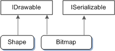

# 002. 单元2——在基于窗口的程序中使用COM

本系列的第1单元展示了如何创建窗口并响应窗口消息，如**WM_PAINT**和**WM_CLOSE**。单元2将介绍组件对象模型（COM）。

COM是用于创建可重用软件组件的规范。您将在基于窗口的现代程序中使用的许多功能都依赖于COM，例如（此列表中的某些技术使用COM的子集，因此不是“纯”COM。）：

- 图形（Direct2D）
- 文字（DirectWrite）
- Windows Shell
- 功能区控件
- UI动画

COM以难以学习而闻名。确实，编写一个支持COM的新软件模块可能会非常棘手。但是，如果您的程序完全是COM的使用者，您可能会发现COM比您期望的更容易理解。

本单元显示如何在程序中调用基于COM的API。它还描述了COM设计背后的一些原因。如果你理解为什么COM按这样设计，你可以更有效地编程它。本单元的第二部分描述了一些推荐的COM编程实践。

COM于1993年推出，用于支持对象链接和嵌入（OLE）2.0。人们有时会认为COM和OLE是一回事。这可能是认为COM难以学习的另一个原因。OLE 2.0是基于COM构建的，但您无需了解OLE即可理解COM。

COM是二进制标准，而不是语言标准：它定义应用程序和软件组件之间的二进制接口。作为二进制标准，COM是语言中立的，尽管它自然地映射到某些C++构造。本单元将重点关注COM的三个主要目标：

- 将对象的实现与其接口分开
- 管理对象的生命周期
- 在运行时发现对象的功能

## 2.1. 什么是COM接口？

如果您了解C#或Java，那么接口应该是一个熟悉的概念。接口定义了一组对象可以支持的方法，而不指定任何实现。接口在调用方法的代码和实现方法的代码之间标记了一个清晰的边界。在计算机科学术语中，调用者与实现是分离的。


在C++中，与接口最接近的等价物是纯虚类 - 即仅包含纯虚方法而不包含其他成员的类。以下是接口的假设示例：

```cpp
// The following is not actual COM.

// Pseudo-C++:

interface IDrawable {
    void Draw();
};
```

这个例子的想法是一些图形库中的一组对象是可绘制的。IDrawable接口定义了任何可绘制对象必须支持的操作。(按照惯例，接口名以“I”开头。)在本例中，IDrawable接口定义了一个操作:Draw。

所有接口都是抽象的，因此程序无法创建IDrawable对象的实例。例如，下面的代码将无法编译。

```cpp
IDrawable draw;
draw.Draw();
```

相反，图形库提供了实现IDrawable接口的对象。例如，库可能提供用于绘制形状的形状对象和用于绘制图像的位图对象。在c++中，这是通过继承一个公共的抽象基类来实现的:

```cpp
class Shape : public IDrawable {
public:
    virtual void Draw(); // Override Draw and provide implementation.
};

class Bitmap : public IDrawable {
public:
    virtual void Draw(); // Override Draw and provide implementation.
};
```

`Shape`和`Bitmap`类定义两种不同类型的可绘制的对象。每个类都继承`IDrawable`并提供自己的`Draw`方法实现。当然，这两种实现可能会有很大不同。例如，该`Shape::Draw`方法可能会栅格化一组线条，同时`Bitmap::Draw`会使像素数组闪烁。

使用此图形库的程序将通过指针操作`Shape`和`Bitmap`对象`IDrawable`，而不是直接使用`Shape`或`Bitmap`指针。

```cpp
IDrawable *pDrawable = CreateTriangleShape();

if (pDrawable) {
    pDrawable->Draw();
}
```

这是一个循环遍历`IDrawable`指针数组的示例。只要数组中的每个对象都继承，该数组可能包含异构的各种形状，位图和其他图形对象`IDrawable`。

```cpp
void DrawSomeShapes(IDrawable **drawableArray, size_t count) {
    for (size_t i = 0; i < count; i++) {
        drawableArray[i]->Draw();
    }
}
```

关于COM的一个关键点是调用代码永远不会看到派生类的类型。换句话说，您永远不会声明类型的变量`Shape`或`Bitmap`代码中的变量。对形状和位图的所有操作都是使用`IDrawable`指针执行的。通过这种方式，COM在接口和实现之间保持严格的分离。`Shape`和`Bitmap`类的实现细节可以更改 - 例如，修复错误或添加新功能 - 而不更改调用代码。

在C ++实现中，接口是使用类或结构声明的。

 **备注：**

本主题中的代码示例旨在传达一般概念，而不是现实世界的实践。定义新的COM接口超出了本系列的范围，但您不能直接在头文件中定义接口。相反，使用称为接口定义语言（IDL）的语言定义COM接口。IDL文件由IDL编译器处理，IDL编译器生成C++头文件。

```cpp
class IDrawable {
public:
    virtual void Draw() = 0;
};
```

使用COM时，请务必记住接口不是对象。它们是对象必须实现的方法的集合。几个对象可以实现相同的接口，如`Shape`和`Bitmap`示例所示。而且，一个对象可以实现多个接口。例如，图形库可能会定义一个名为`ISerializable`支持保存和加载图形对象的接口。现在考虑以下类声明：

```cpp
// An interface for serialization.
class ISerializable {
public:
    virtual void Load(PCWSTR filename) = 0; // Load from file.
    virtual void Save(PCWSTR filename) = 0; // Save to file.
};

// Declarations of drawable object types.

class Shape : public IDrawable {
    ...
};

class Bitmap : public IDrawable, public ISerializable {
    ...
};
```

在此示例中，`Bitmap`类实现`ISerializable`。程序可以使用此方法来保存或加载位图。但是，`Shape`该类没有实现`ISerializable`，因此它不公开该功能。下图显示了此示例中的继承关系。



本节已经检查了接口的概念基础，但到目前为止我们还没有看到实际的COM代码。我们将从任何COM应用程序必须做的第一件事开始：初始化COM库。

## 2.2. 初始化COM库

任何使用COM的Windows程序都必须通过调用`CoInitializeEx`函数来初始化COM库。每个使用COM接口的线程都必须单独调用这个函数。`CoInitializeEx`有以下签名:

```cpp
HRESULT CoInitializeEx(LPVOID pvReserved, DWORD dwCoInit);
```

第一个参数是保留的，必须为`NULL`。第二个参数指定程序将使用的线程模型。COM支持两种不同的线程模型，套间线程和多线程。如果你指定套间线程，你做以下保证:

- 你将从一个线程访问每个COM对象;你不会在多个线程之间共享COM接口指针。
- 线程将有一个消息循环。(参见单元1中的窗口消息。)

如果这两个约束都不满足，那么使用多线程模型。要指定线程模型，请在dwCoInit参数中设置以下标志之一。

-  **COINIT_APARTMENTTHREADED** 
-  **COINIT_MULTITHREADED** 

您必须设置这些标志之一。 通常，创建窗口的线程应使用COINIT_APARTMENTTHREADED标志，而其他线程应使用COINIT_MULTITHREADED。 但是，某些COM组件需要特定的线程模型。 MSDN文档应该告诉您何时是这种情况。

注意：实际上，即使您指定单元线程，也仍然可以使用称为封送处理的技术在线程之间共享接口。 封送处理超出了本模块的范围。 重要的一点是，对于套间线程，您绝不能简单地将接口指针复制到另一个线程。 有关COM线程模型的更多信息，请参见进程，线程和单元。

除了已经提到的标志之外，最好在dwCoInit参数中设置COINIT_DISABLE_OLE1DDE标志。 设置此标志可避免与对象链接和嵌入（OLE）1.0（一种过时的技术）相关的一些开销。

这是初始化用于套间线程的COM的方法：

```cpp
HRESULT hr = CoInitializeEx(NULL, COINIT_APARTMENTTHREADED | COINIT_DISABLE_OLE1DDE);
```

HRESULT返回类型包含错误或成功代码。 我们将在下一部分中介绍COM错误处理。

### 取消初始化COM库

对于每次成功调用CoInitializeEx，必须在线程退出之前调用CoUninitialize。 该函数不带参数，没有返回值。

```cpp
CoUninitialize();
```

## 2.3. COM中的错误码

为了指示成功或失败，COM方法和函数返回HRESULT类型的值。 HRESULT是32位整数。 HRESULT的高位指示成功或失败。 零（0）表示成功，而1表示失败。

这将产生以下数值范围：

- 成功：0x0 - 0x7FFFFFFF 
- 失败：0x80000000 - 0xFFFFFFFF 

少数COM方法不返回HRESULT值。 例如，AddRef和Release方法返回无符号的long值。 但是，每个返回错误代码的COM方法都通过返回HRESULT值来实现。

若要检查COM方法是否成功，请检查返回的HRESULT的高位。 Windows SDK标头提供了两个宏，可简化此操作：SUCCEEDED宏和FAILED宏。 如果HRESULT是成功代码，则SUCCEEDED宏返回TRUE，如果错误代码是FALSE，则返回FALSE。 以下示例检查CoInitializeEx是否成功。

```cpp
HRESULT hr = CoInitializeEx(NULL, COINIT_APARTMENTTHREADED | 
    COINIT_DISABLE_OLE1DDE);

if (SUCCEEDED(hr)) {
    // The function succeeded.
} else {
    // Handle the error.
}
```

有时，测试相反的条件会更方便。 FAILED宏的执行与SUCCEEDED相反。 对于错误代码，返回TRUE，对于成功代码，返回FALSE。

```cpp
HRESULT hr = CoInitializeEx(NULL, COINIT_APARTMENTTHREADED | 
    COINIT_DISABLE_OLE1DDE);

if (FAILED(hr)) {
    // Handle the error.
} else {
    // The function succeeded.
}
```

在本单元的后面，我们将介绍一些实用的建议，以帮助您构造代码以处理COM错误。 （请参阅COM中的错误处理。）

## 2.4. 在COM中创建对象

线程初始化COM库后，该线程可以安全使用COM接口。 要使用COM接口，您的程序首先创建一个实现该接口的对象的实例。

